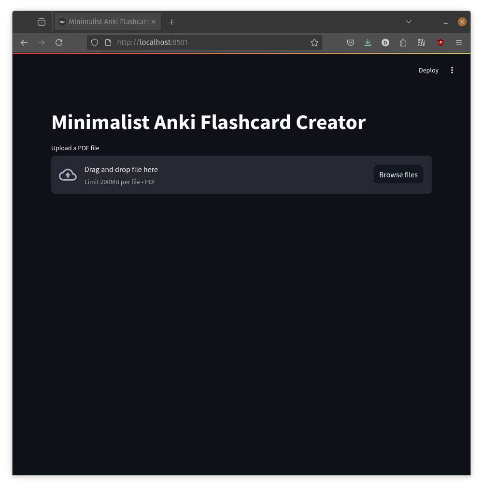
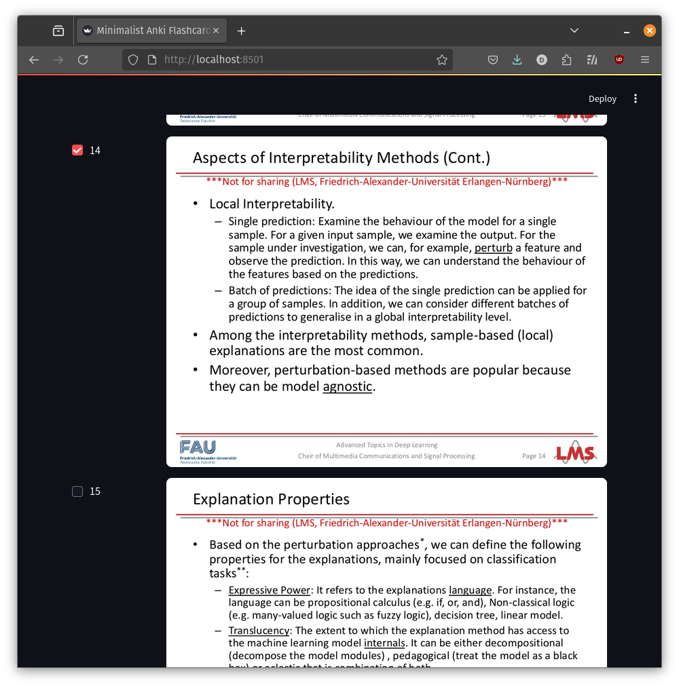
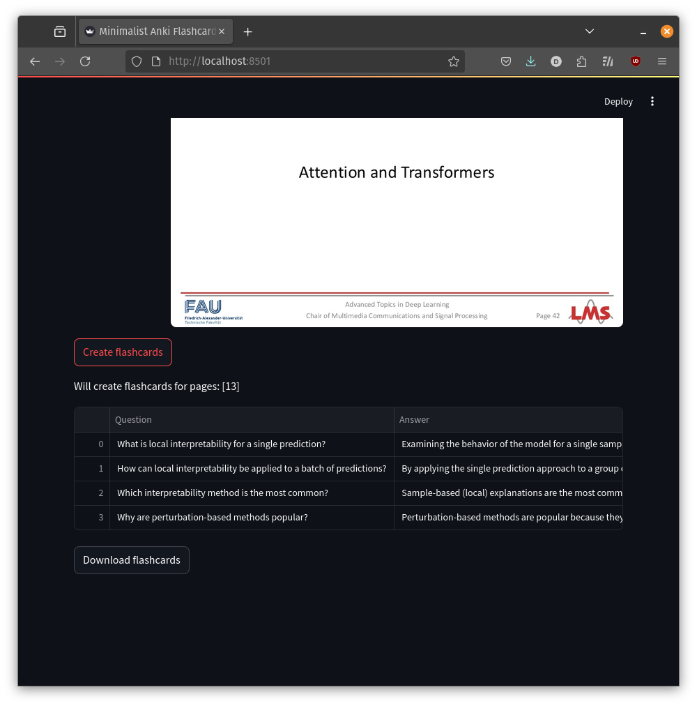

# Minimalist Anki Flashcard Creator


A lightweight tool that helps you create Anki flashcards from PDF study materials. Using GPT-3o or GPT-4o, it automatically extracts key information and generates well-structured flashcards, saving you time and effort in your study preparation.

## Screenshots

*The main interface showing PDF upload*


*The main interface showing PDF upload and page selection*


*Generated flashcards ready for export*

## Features

- **PDF Document Processing**: Upload and process PDF files to extract content
- **AI-Powered Flashcard Generation**: Uses OpenAI's language model to create intelligent flashcards
- **Exercise Flashcard Support**: Create flashcards from exercises with questions, solutions, and detailed solution steps
- **Smart Model Selection**: Automatically chooses between GPT-4o and GPT-3.5-turbo based on content complexity
- **Deep Analysis Mode**: Optional detailed analysis of graphics and text complexity for better results
- **Page Selection**: Choose specific pages from your PDF to generate flashcards
- **Structured Output**: Generates flashcards in a format compatible with Anki
- **Easy Export**: Download flashcards as CSV files for direct import into Anki
- **User-Friendly Interface**: Built with Streamlit for an intuitive user experience

## Prerequisites

- Python 3.7 or higher
- OpenAI API key
- Poppler (for PDF processing)

## Installation

1. Clone the repository:
```bash
git clone https://github.com/dennismstfc/minimalist-anki-flashcard-creator.git
cd anki_flashcard_creator
```

2. Create and activate a virtual environment:
```bash
python -m venv venv
source venv/bin/activate  # On Windows, use: venv\Scripts\activate
```

3. Install the required dependencies:
```bash
pip install -r requirements.txt
```

4. Install Poppler (required for PDF processing):
   - On Ubuntu/Debian:
     ```bash
     sudo apt-get install poppler-utils
     ```
   - On macOS:
     ```bash
     brew install poppler
     ```
   - On Windows:
     Download and install from: https://github.com/oschwartz10612/poppler-windows/releases/

5. Set up your OpenAI API key:
   - Create a `.env` file in the project root
   - Add your API key: `OPENAI_API_KEY=your_api_key_here`

## Usage

1. Start the application:
```bash
streamlit run main.py
```

2. Open your web browser and navigate to the provided local URL (typically http://localhost:8501)

3. Upload your PDF file using the file uploader

4. Select the pages you want to generate flashcards from

5. **Choose your flashcard type**:
   - **Regular Flashcards**: Standard Q&A format for general study material
   - **Exercise Flashcards**: For documents containing exercises with questions and solutions (automatically generates solution steps if not provided)

6. **Optional: Enable Deep Analysis**:
   - Performs detailed analysis of graphics and text complexity
   - Automatically disabled when exercise mode is selected
   - Takes longer to process but may provide better results for complex documents

7. Click "Create flashcards" to generate the flashcards

8. Download the generated flashcards as a CSV file

9. Import the CSV file into Anki:
   - Open Anki
   - Click File > Import
   - Select your downloaded CSV file
   - Choose the appropriate delimiter (semicolon)
   - Map the columns to your desired Anki fields

## Project Structure

```
anki_flashcard_creator/
├── main.py              # Main application entry point
├── creator.py           # Flashcard generation logic
├── analyzer.py          # Content analysis and model selection
├── pdf_viewer.py        # PDF viewing and processing
├── utils.py            # Utility functions
├── structures.py       # Data structures
├── few_shot_examples.py # Example prompts for AI
├── requirements.txt    # Project dependencies
└── few_shot_data/      # Example data for AI training
```

## Contributing

Contributions are welcome! Please feel free to submit a Pull Request. For major changes, please open an issue first to discuss what you would like to change.

## License
This project is licensed under the CC 4.0 license.

## Support

If you encounter any issues or have questions, please open an issue in the GitHub repository or contact me under dennismstfc@gmail.com
